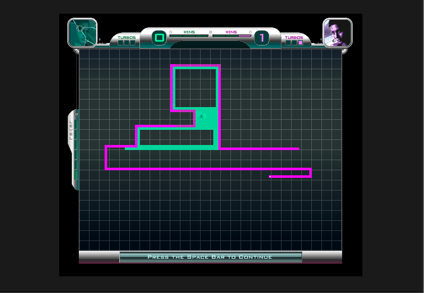

# tron_remix
Tron remix of the classic arcade game. Built with JS, jQuery, HTML, CSS. 

##### Control a light cycle and try to make your opponent crash into a wall before you do. Use the arrow keys to move and press enter for turbo.



### Technologies Used
- html
- css
- javascript
- blood, sweat and internal-tears (human tech)

### Code Example
```javascript
// js here
```
### Build Strategy
1. Pseudo so hard
    - Lo-Fi Wireframe
    - Find MVP
2. Pseudo so good
    - Hi-Fi Wireframe
    - Daydream about cyberpunks and neon laser beams
3. Hard Code
    a. Work on MVP's unstyled elements
    b. Create win-state logic
    c. CSS 
        - Create initial board state
        - Transition pieces
4. Add in as many neons lasers as possible

### Contributing
Momajd, who showed me this was actually *possible* with a limited tech stack.
Shoutout to and [GA](generalassemb.ly) and my amazing ILs, IAs and TAs for being the angels/devils on my shoulders. 
Shoutout to the Arbiter for being the best-practice-coder-voice in my head.
### Complications/Future Improvements
Complications/Challenges/Handicaps: 
- Minimal to no use of libraries
Future Improvements: 
- Many, will add later.

### Authors
Hello, my name is...
#### Inspiration & References
[Flash Tron - Play original FlTron & Variations!](http://www.fltron.com/)
One of the most long-lived light-cycle games out there - mainly for its trash-talking babes in storied progression.
[Visual Designer of FlashTron](http://mefuzzy.com/)
[MVP Goals](https://scratch.mit.edu/projects/2596752/#editor)
[Pro Gamer Tips](http://www.flash-cycle.com/tips/)
