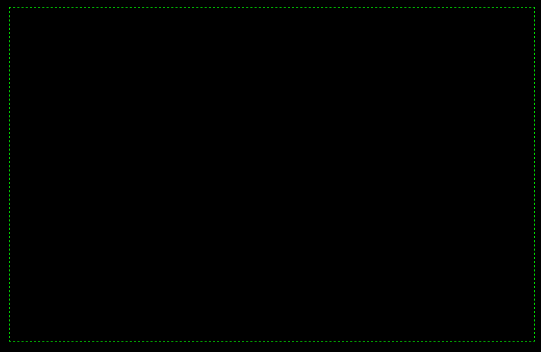

# tron_remix
Tron remix of the classic arcade game. Built with JS, jQuery, HTML, CSS. 

##### Control a light cycle and try to make your opponent crash into a wall before you do. Use the arrow keys to move and press enter for turbo.



### Technologies Used
- html
- css
- JS/jQuery

### Code Example
```javascript
// js here
```
### Build Strategy
1. Pseudo so hard
    - Lo-Fi Wireframe
    - Find MVP
2. Pseudo so good
    - Hi-Fi Wireframe
    - Daydream about cyberpunks and neon laser beams
3. Hard Code
    - Work on MVP's unstyled elements
    - Create win-state logic
    - CSS 
    - Create initial board state
    - Transition pieces
4. Add in as many neons lasers as possible

### Contributing
Shoutout to the voices in my head: Vince/Patrick/Joe/Paris/Kate/Ariana/Alison.

### Complications/Future Improvements
Complications/Challenges/Handicaps: 
- Minimal to no use of libraries
Future Improvements: 
- Many, will add later.

### Authors
Hello, my name is...
#### Inspiration & References
- [Adam Khoury Canvas Bootcamp](https://www.youtube.com/watch?v=bCYz_N6BIPw&list=PLlkGN-8wjPHWYT_00xdUibDPfHZ3Zm8i3)
    - Clear and concise intro to the rabbit hole that is Canvas.
- [Flash Tron - Play original FlTron & Variations!](http://www.fltron.com/)
    - WebDev dreams of reaching this technical skill level.
- [Visual Designer of FlashTron](http://mefuzzy.com/)
- [Tron MVP Goals](https://scratch.mit.edu/projects/2596752/#editor)
- [Snake Tutorial in HTML5 & JS](https://youtu.be/4tkixl4Bt3I)
- [Momajd](github.com)
    -For being the tempting yet resistable devil on my shoulder.
